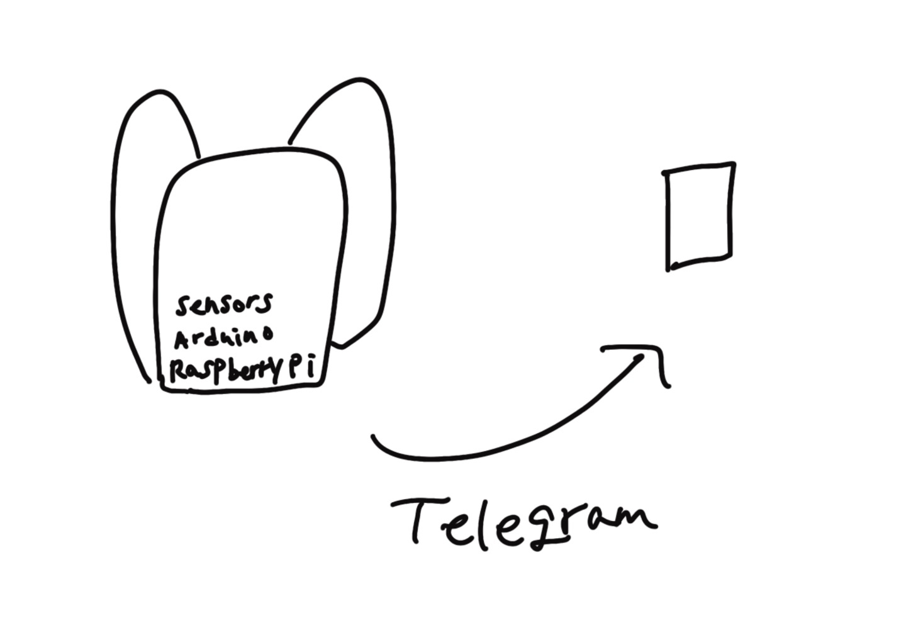

# ITC_2023_2_무선네트워크_4

인하공업전문대학 2023-2학기 무선네트워크 프로젝트 4조

조원 : 박세현, 유성운, 차진우, 최민주, 최진혁, 홍승호

# Concept

### 아이디어제목 - 차진우

#### 1. 개요

초기 아이디어 회의를 위한 단락입니다.  이와 같은 양식으로 작성해주세요. 반드시 모든 항목을 채우지 않아도 되며, 아이디어가 완전하지 않아도 괜찮습니다. 필요하다면 항목을 추가/수정하여 작성해도 됩니다.  

제안된 아이디어에 대한 의견이나 피드백은 다음 이슈를 사용하세요
https://github.com/startedourmission/ITC_2023_2_WirleesNetwork_4/issues/1#issue-1969961494

#### 2. 개발 목적

아이디어가 완전히 새로울 필요는 없습니다. 다만 기획 + 필요 물품 배송 기간 +  구현 및 완성 기간을 고려하여 4~5주 내 완성될 수 있도록 스케일링해야합니다. 

#### 3. 필요 기술

1. 기반 : 라즈리파이, 아두이노
2. 센서 : 무슨무슨 센서
3. 언어 : Python

#### 4. 참조

참고한 논문, 블로그 책 등을 반드시 기록해주세요

***

### 택배 도난 방지 시스템 - 최진혁

#### 1. 개발 목적

CCTV가 없는 집에 경우 집앞에 놓여진 택배가 도둑 맞을 가능성이 있기에
지하철의 보관함처럼 택배 보관함을 집앞에 설계 할려고 합니다.

#### 2. 기반

1. 라즈베리파이
2. 아두이노 무게감지 센서
3. NFC 모듈
4. 도어락
5. 카메라 센서

#### 3. 사용 기술

- 도어락 제어 : 아두이노 / python , C언어
- 라즈베리파이를 통해서 사용자에 핸드폰에 보관함의 상태 변화를 전송
- 카메라 센서를 통해서 택배 확인및 도둑 확인
- 무게 센서를 통해 도어락 잠금 제어

#### 4. 참조
https://twinw.tistory.com/136

***

### AI 선풍기 - 차진우

#### 1. 개발목적

기존 선풍기는 고정된 각도로 회전하도록 되어있기 때문에 비효율이 발생. 선풍기가 사람 없는 쪽으로 바람을 보내는 시간동안 더워하는 것이 고통스러움. 또한 선풍기가 멀리 있을 경우 각도를 조절하거나 가까이 가져오기 번거로움.

#### 2. 필요 장비 및 센서

1. 아두이노, 라즈베리파이
2. pi카메라
3. 선풍기 회전 및 바퀴에 사용될 모터
4. 선풍기 날개

#### 3. 사용 기술

- 선풍기 조작 : 아두이노 / Python
- 라즈베리파이 -> 서버 영상 전송 : 스트리밍 (g streamer, ffmpeg 등) 고려 중
- 서버 -> 라즈베리파이 데이터 전송 : 웹 소켓 고려 중
- 딥러닝 영상 처리 -> Pre-trained Object Detection 모델 (YOLO 등)

***

#### 무선 기상관측소 - 박세현

#### 1. 개발 목적

개인이나 가정 환경에서 사용자가 현재 날씨 정보를 실시간으로 확인하고, 이 정보를 활용하여 다양한 자동화 작업을 수행할 수 있도록 도움을 주는 것. 예를 들어, 기상 관측 데이터를 기반으로 스마트 창문 덮개를 자동으로 조절하거나, 난방 및 냉방을 최적화하여 에너지를 절약할 수 있습니다.

#### 2. 필요 장비 및 센서

- 습도, 온도, 압력 및 공기질 센서
- 안테나
- 방수 상자
- LTR-559 (조도, 근접도)
- 12비트 ADC
- IPS LCD

#### 3. 사용 기술

- 아두이노 / python

#### 4. 참조
https://howtomechatronics.com/tutorials/arduino/arduino-wireless-weather-station-project/

https://robobob.tistory.com/67
https://bota.tistory.com/1710
https://kocoafab.cc/tutorial/view/322
***

#### 미니 출석시스템 - 홍승호

#### 1. 개발 목적

라즈베리파이를 이용한 간편 출석 시스템을 구축하여 효율적인 데이터 처리 및 관리를 위함

#### 2. 필요 장비 및 센서

- RC522 RFID 리더기
- 10k 옴 가변저항기
- 16x2 LCD

#### 3. 사용 기술

- 아두이노 / python

#### 4. 참조
https://pimylifeup.com/raspberry-pi-rfid-attendance-system/

***
#### 공기질 측정 백팩 - 유성운

#### 1. 개발 목적

가방에 센서를 장착하여 사용자의 이동 환경에 맞춰 대기 질을 실시간으로 측정하고 Telegram으로 사용자에게 대기 환경 정보를 전달하고 마스크 권고와 같은 대안을 추천하며 GPS로 시간 및 장소를 수집해 일간, 주간, 월간 통계를 전달한다. 출퇴근 시 지하철 안 지하철 역사, 장거리 이동 혹은 대기 정보가 제공되지 않는 곳에서 체류 시 유용

#### 2. 필요 장비 및 센서

- 습도, 온도, 공기질 센서
- GPS
- 아두이노, 라즈베리파이
- 가방
- 보조배터리

#### 3. 사용 기술

1. 기반 : 라즈베리파이, 아두이노
2. 센서 : 대기 측정 센서
3. 언어 : Python

#### 4. 참조
https://biz.chosun.com/it-science/ict/2023/02/04/34R26QSKFBG7BIAMQZFTMP5AKA/
https://arduinosensors.tistory.com/category/%EB%AA%A8%EB%91%90%EC%9D%98%20%EC%95%84%EB%91%90%EC%9D%B4%EB%85%B8%20%ED%99%98%EA%B2%BD%20%EC%84%BC%EC%84%9C/2%EC%9E%A5%20%EB%AF%B8%EC%84%B8%EB%A8%BC%EC%A7%80%20%EC%B8%A1%EC%A0%95%20%EC%84%BC%EC%84%9C

***

### 최저가 물품 검색 시스템 - 최민주

#### 1. 개발목적

카메라로 상품을 찍으면 인터넷에서 최저가 상품을 찾아 텔레그램으로 전달해 준다. 

#### 2. 필요 장비 및 센서

1. 라즈리파이, 아두이노
2. pi카메라

#### 3. 사용 기술
- 카메라로 찍은 물건 식별 : 아두이노 / python
- 최저가 찾는 사이트에 물건 검색 : python
- 최저가 사이트 링크 텔레그램으로 전달 : python
  
#### 4. 참조

https://blog.naver.com/PostView.naver?blogId=fkdldjs60&logNo=222161730266&parentCategoryNo=&categoryNo=11&viewDate=&isShowPopularPosts=false&from=postView
https://catloaf.tistory.com/19
***
