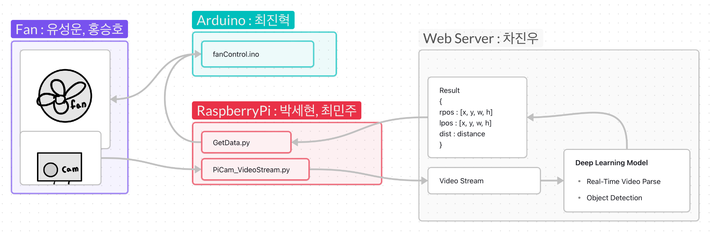

# ITC_2023_2_무선네트워크_4

인하공업전문대학 2023-2학기 무선네트워크 프로젝트 4조

조원 : 박세현, 유성운, 차진우, 최민주, 최진혁, 홍승호

# Concept

### 선풍기 - 차진우 ✅

#### 1. 개발목적

기존 선풍기는 고정된 각도로 회전하도록 되어있기 때문에 비효율이 발생. 선풍기가 사람 없는 쪽으로 바람을 보내는 시간동안 더워하는 것이 고통스러움. 또한 선풍기가 멀리 있을 경우 각도를 조절하거나 가까이 가져오기 번거로움.

#### 2. 필요 장비 및 센서

1. 아두이노, 라즈베리파이
2. pi카메라
3. 선풍기 회전 및 바퀴에 사용될 모터
4. 선풍기 날개

#### 3. 사용 기술

- 선풍기 조작 : 아두이노 / Python
- 라즈베리파이 -> 서버 영상 전송 : 스트리밍 (g streamer, ffmpeg 등) 고려 중
- 서버 -> 라즈베리파이 데이터 전송 : 웹 소켓 고려 중
- 딥러닝 영상 처리 -> Pre-trained Object Detection 모델 (YOLO 등)

## 상세

### 1. 하드웨어 구성
담당 : 유성운, 홍승호

- 선풍기 형태 구축, 아두이노로 제어 가능한 형태로 하드웨어 설계
#### 진행상황

- [ ] 필요 물품 구매 목록 정리
	- DC 모터
	-  서보 모터
	-  선풍기 날개
	-  NPN 트랜지스터
	-  다이오드
	-  저항

***
### 2. 클라이언트 - 서버 통신
담당 : 박세현, 최민주

- 통신 프로토콜 설계
- 라즈베리파이 -> 웹 서버 영상 전송
- 웹 서버 -> 라즈베리파이 각도 및 거리 데이터 파싱

#### 진행상황

- [ ] 프로토콜 종류 결정 및 구현 기획

***
### 3. 영상 처리 서버 구축
담당 : 차진우

- 수신된 영상에서 사람 bounding bod 좌표 추출 및 필요 각도, 거리 계산
- 웹 서버에 업로드

#### 진행상황

- [ ] 웹 서버 구축 📅 2023-11-13 
	- Python - Flask 사용
- [ ] Human Detector 모델 테스트
	후보
	- YOLOv3
	- YOLOv8
	- TinyYOLO
	- MobileNet + SSD
- [ ] 송수신 테스트
	- 클라이언트 - 서버 통신 이후 진행

***
### 4. 선풍기 조작
담당 : 최진혁

- 파싱된 데이터 -> 선풍기 제어 프로그램
#### 진행상황

- [ ] 테스트 데이터로 기본 프로그램 작성
- [ ] 데이터 수신 확인
