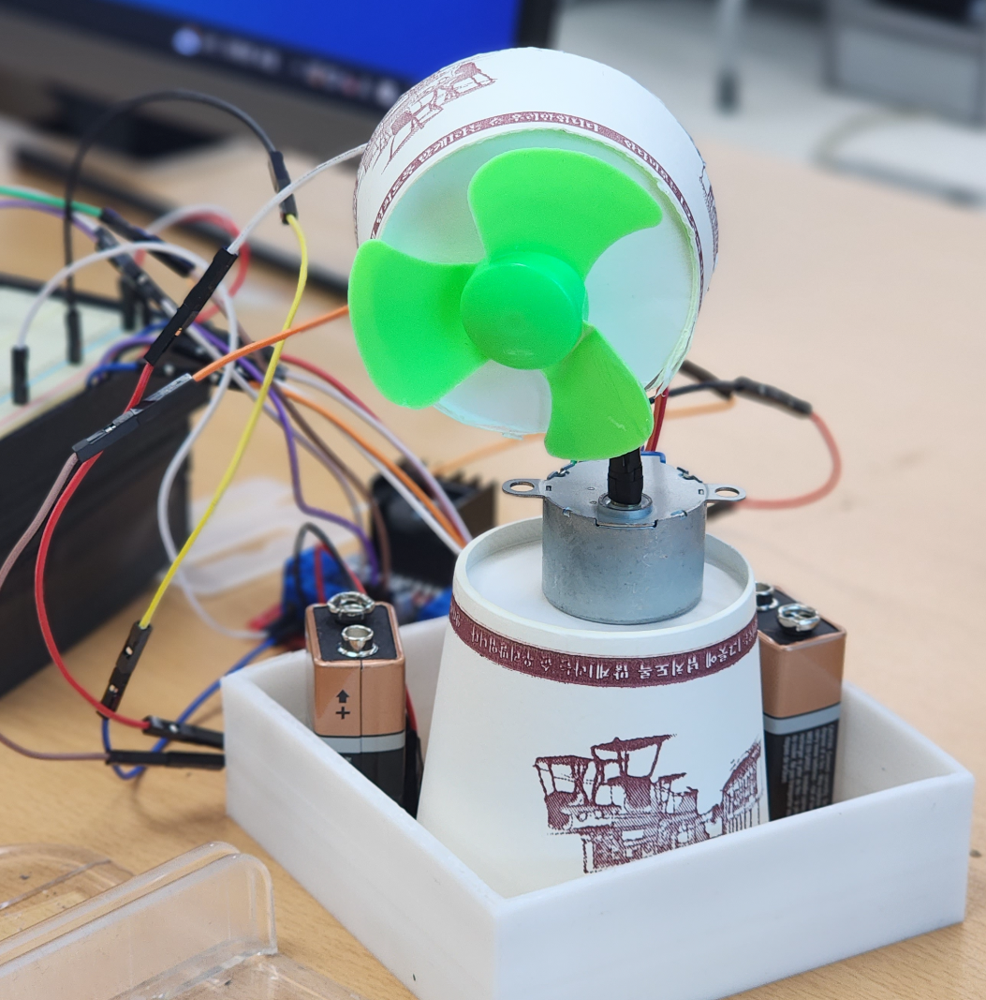

# 선풍이


인하공업전문대학 2023-2학기 무선네트워크 프로젝트 4조

박세현 (fromsehyeon), 유성운(withthemoonrabbit), 차진우(startedourmission), 최민주(lllllIIlI), 최진혁(wmsgur8679), 홍승호(spdlqj538)


# Concept


#### 1. 개발목적

기존 선풍기는 고정된 각도로 회전하도록 되어있기 때문에 비효율이 발생. 선풍기가 사람 없는 쪽으로 바람을 보내는 시간동안 더워하는 것이 고통스러움. 또한 선풍기가 멀리 있을 경우 각도를 조절하거나 가까이 가져오기 번거로움.


#### 2. 필요 장비 및 센서

1. 아두이노, 라즈베리파이
2. pi카메라
3. 선풍기 회전 및 바퀴에 사용될 모터
4. 모터드라이버
5. 선풍기 날개

#### 3. 사용 기술

- 선풍기 조작 : 아두이노 / Python
- 라즈베리파이 -> 서버 영상 전송 : 스트리밍 (g streamer, ffmpeg 등) 고려 중
- 서버 -> 라즈베리파이 데이터 전송 : 웹 소켓 고려 중
- 딥러닝 영상 처리 -> Pre-trained Object Detection 모델 (SSD + MobileNet)

# 과정

### 12주차 | 11.14 ~ 11.21

- 최진혁 : 아두이노 시리얼 통신 제어 코드 작성
	
	라즈베리 파이에서 수신한 데이터를 이용하여
	선풍기 각도, 모터 속도 제어
	
- 차진우 : API 서버 구축 완료
	
	기존 HTTP 방식으로만 요청할 수 있는 API 서버에 웹 소켓 기능 추가 — 사용안함
	프레임 저장 시 클라이언트 ip주소 + 날짜 시간 데이터 생성


### 13주차 | 11.21 ~ 11.28

- 유성운, 홍승호
	아두이노에 스탭모터, DC모터, 모터 드라이브 연결
	모터 제어 테스트 완료
- 차진우 
	웹 서버 https 보안 연결 기능 추가 — 사용안함
- 박세현, 최민주
	pc에서 usb 카메라 영상 촬영 테스트 완료
	라즈베리파이 클라이언트 - 웹 서버 이미지 전송 테스트 완료
- 최진혁
  	입력 받은 각도 값을 계산해 스텝모터를 최단거리 (반시계 , 시계방향)로 이동하는 코드 작성

### 14주차 | 11.28 ~ 12.4

- 웹 서버 버그 수정
- 코드 자동 실행 설정
- 프레임 제작 및 파츠 결합
- 배터리 추가 연결 - 전력 문제 해결
- 모터 각도 테스트 후 코드 최종 수정
- 프레임 결합


## 상세

### 1. 하드웨어 구성
담당 : 유성운, 홍승호

- 선풍기 형태 구축, 아두이노로 제어 가능한 형태로 하드웨어 설계
#### 진행상황

- [x] 필요 물품 구매 목록 정리
      
  - 라즈베리파이 x1 o
  - 브레드보드 x1 o
  - 아두이노 x1 o
  - 카메라 모듈 x1 o
  - 서보 모터 x1 o
  - 모터 컨트롤러 x1 o
  - DC 모터 x1 o
  - DC 모터 프로펠러 FAN 80mm x1 o
  - 아두이노 RC카용 모터 & 바퀴세트 x4 o
  - 9V 배터리 연결 잭 x1 o

- [x] 프레임 제작
- [x] 구성요소 결합
- [x] 배터리 추가

***
### 2. 클라이언트 - 서버 통신
담당 : 박세현, 최민주

- 통신 프로토콜 설계
- 라즈베리파이 -> 웹 서버 영상 전송
- 웹 서버 -> 라즈베리파이 각도 및 거리 데이터 파싱

#### 진행상황

- [x] 프로토콜 종류 결정 및 구현 기획
      - HTTP 사용
- [x] 통신 프로토콜 설계
- [x] 웹 서버 이미지 전송
- [x] 라즈베리파이 테스트
- [x] 각도 및 거리 데이터 파싱
- [x] 최종 테스트

***
### 3. 영상 처리 서버 구축
담당 : 차진우

- 수신된 영상에서 객체 bounding bod 좌표 추출 및 필요 각도, 거리 계산
- 사람 카테고리만 전송
- 웹 서버에 업로드

#### 진행상황

- [x] 웹 서버 구축 📅 2023-11-8 
	- Python - Flask 사용
- [x] Human Detector 모델 테스트
	- MobileNet + SSD ✅

**웹서버 통신 테스트**

- [x] 샘플 이미지 테스트

MobileNet + SSD 사용

cURL POST Test
```sh
surl -x POST -F “file=@PATH” 웹서버주소/upload
```

```json
[
	{
		“box”:[  //전체 bounding box 좌표
		x1,
		y1,
		x2,
		y2
		],
		“center”:[ //bounding box 중앙 좌표
		x,
		y
		],
		“class” : “person”,  //classification class
		“confidence”: 0~1    // 정확도
	}
]
```


***
### 4. 선풍기 조작
담당 : 최진혁

- 파싱된 데이터 -> 선풍기 제어 프로그램
#### 진행상황

- [x] 테스트 데이터로 기본 프로그램 작성
- [x] 데이터 수신 확인
